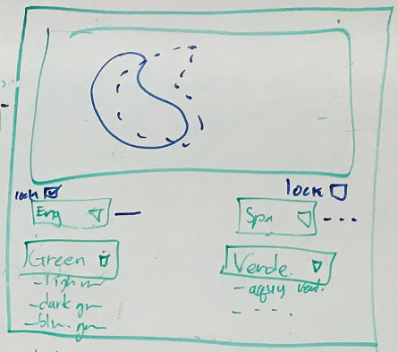

Assignment3
===============

## Team Members

1. Kyle Thayer
2. Younghoon Kim

## Color Translater

Color Translater presents the translation of colornames in different language through color map. 
Through the cycle of translating, we'd like users you to explore the color-colorname-language space!

We collected the dataset from the Amazon Mechanical Turk during CSE510 course project. The dataset is comprised of the following.

- color code in R,G,B
- colorname 
- language

Note that this is a very small data set and many of the people who gave us color names were not native speakers of the language they answered in. Please do not assume that our data reflects color names accurately (for example, in the above image, you can see that someone called a bright green "yellow" in our dataset). We are planning on doing a much larger data collection this quarter.

This visualization is a redesign of [one we made for a class project](http://carlise.cs.washington.edu:8385/color-translator/index.html) for HCI (CSE510) last quarter.

## Running Instructions

Access our visualization at http://cse512-16s.github.io/a3-kylethayer-yhoonkim/, or download this repository and run `python -m SimpleHTTPServer 9000` and access this from http://localhost:9000/.

## Story Board

For our visualization we wanted to redesign [a visualization we made for a class project](http://carlise.cs.washington.edu:8385/color-translator/index.html) last quarter in CSE510. That visualization used Self-Organizing Maps to make a 2D layout of the relevant color space, which was displayed using colored tiles for each node of the Map.

We liked how that visualization allowed exploration of the data, but it was confusing to new users, hard to compare and hard to use. 

We chose three specific user stories from the old Color Translator, plus desire for general exploration. Our intention was to focus on how these tasks could be done with greater ease and clarity:

1. Translate a colorname in another language.
2. See what color a colorname indicates 
3. Compare two colornames by their corresponding colors.  
4. Explore the color-colorname-language space.

Our first major redesign was to only have one view of the Self-Organizing Map, which we thought would make comparisons easier, and make it more obvious what was being displayed. Another change was we wanted to make everything work symmetrically. A large confusion in the old visualization was that the left was considered the "source" and the righ was the "target" and if a color name on the right was selected, the languages swapped locations to put that new color name as the "source." We wanted things to stay in place to make it easier to use.

We choose the dropdown boxes for interaction methodes because the types of "language" and "colorname" in our dataset are nominal. One of other design choices was using keyboard as interaction input like NameVoyager. It could give more freedom and easy access to explore the languages and colornames. But we set this as a stretch-goal in order to meet the schedule. 

We decided the interface would automatically select a suggested translation for the other language when a color is selected, and we wanted this to work symmetrically from both the left and right side. We did still want users to pick two arbitrary colors without the auto-translation changing things, so we went through a number of possibilites:

 As you can see, we brainstormed possible UIs for controling the mode (auto translation mode / comparing mode) of ColorTranslater (like the below) or using 'Lock' checkboxes are for fixing the selected items of the dropboxes. And we decided to provide lock checkbox due to its' simplicity.

In the end, we came up with this interface:

Here are how a user would achieve their tasks:

#### 1. Translate a color in another language.

- Pick a colorname's language to translate from left language dropdown box (the upper left one).
- Pick the colorname from left colorname dropdown box (the bottom left one).
- Pick a language to translate in from right language dropdown box (the upper right one).
- Then, translated colornames will be shown under the right colorname dropdown boxes in the decending order of similarity.

#### 2. See what color a colorname indicates.

- Pick a colorname's language to translate from left language dropdown box (the upper left one).
- Pick the colorname from left colorname dropdown box (the bottom left one).
- Then, a corresponding color region will be shown on the color map.

#### 3. Compare two colornames by their corresponding colors.

- Pick first colorname, and its language from left dropdown boxes.
- Check "lock" checkbox to lock the colorname.
- Pick second colorname, and its language from right dropdown boxes.
- Then, two corresponding color regions will be shown on the color map.

#### 4. Explore the color-colorname-language space.

- Users can see the color regions of the translated colornames on the map by hovering their mouse cursor.
- Iteratively doing #1,#2, and #3, user can explore the color-colorname-language space.

(*For all four stories, User also can do the same things starting from right dropboxes.*)

### Changes between Storyboard and the Final Implementation

Our first, minor change from the storyboard was moving the "Lock" checkbox next to the color name and not the language, since it is the color being locked.

In the storyboard, we attempted to present the regions by drawing their border(the first of the belows) but when we did so, it was very hard to intepret, both because it was too blocky, and also because our data was sparse and had holes in it:

Even when we tried to increase the resolution of the Self-Organizing Map, the holes in our data still made it too hard to read:

At this point we either needed to get more data, find a way of cleanin our data or trying a different visualization.

Our next attempt was to use size of the rectangles used to display the nodes. Full size is when both selected color names were used for a color, mid-size is when only one of the two was used, and small for when neight color name was used for a color:

We thought this was the best looking of all our visualizations, but it required interaction to discover which of the two color terms applied to the mid-size color tiles.

Next we tried adding vertical or horizontal direction to the mid-size tiles to show which color term went with it:

The reason we rejected this one was because it was hard to visually group together the squares with either the verticle or horizontal rectangles. 

Next we tried variations of verticle and horizontal rectangles an crosses for when both names applied.

These worked better. We could visually group each term's area separately and see the overlap, but we felt there was too much lost with all the white space.

We ended up settling on using horizintal and verticle lines overlayed on the color map.

Initially we had trouble getting the lines to show up on both dark and light backgrounds, so we decided to make the lines in the hatch marks side-by-side black and white lines. With this, the white lines show up against dark backgrounds and the dark lines show up agains light backgrounds.

The lines do obscure the color they highlight, both making the colors appear a little different in context and making it more of an effort to see the color behind the lines. Since almost all means of highlighting colors had some problem with changing the appearance of the colors to some extent, the other forms of highlighting tended to either be too hard to discern, or obscured the color even more. 

One possibility for future consideration would be to go back to the simply sized squares, but use two displays of the same Self-Organizing Map, one for each color term. This would probably be more visually pleasing, but it would be challenging to directly observer smaller differences between color name borders.

## Development Process

To update the user interface we split the work as follows:
 - Kyle
  - Change the code to make the interface symmetric (the old version had the left as a "source" and right as a "destination").
  - Fix bugs with the Self-Organizing Map
  - Fix bugs with the color selection
  - Create some of the highlighting methods
 - Younghoon
  - D3-ify the code that drew the Self-Organizing Map tiles.
  - Merge the two SOMs into one (including all the code which referenced two)
  - Create better code to use for highlighting the colors
  - Create most of the highlighting methods

We spent approxomately the following time each:
 - 4 hours brainstorming and designing visualization
 - 6 hours doing initial code fixing and creating the line version of the code
 - 6 hours testing different ways of showing the two color areas on the same chart
 - 4 hours debugging and cleaning up the interface
 - 2 hours working on the writeup
 
Of that, we hadn't planned on needing all the extra time to try new methods of showing the two different areas. Debugging also took a long time, but that is a normal, though frustrating reality of most programming projects.
